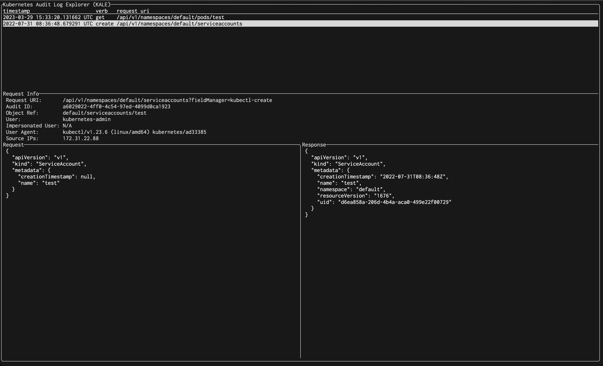

# Kubernetes Audit Log Explorer (KALE)

Assuming you've got some audit logs:

```shell
$ cat data
{"kind":"Event","apiVersion":"audit.k8s.io/v1","level":"Metadata","auditID":"ec95c2ca-00d4-40b9-93b4-78a6eb1242c7","stage":"ResponseComplete","requestURI":"..."
{"kind":"Event","apiVersion":"audit.k8s.io/v1","level":"Metadata","auditID":"2f8eb783-8d8b-4540-92db-899f5f0f126a","stage":"ResponseComplete","requestURI":"..."
{"kind":"Event","apiVersion":"audit.k8s.io/v1","level":"Metadata","auditID":"cddf4c0e-9eda-4e17-b9bf-a0af05132186","stage":"ResponseComplete","requestURI":"..."
```

`kale` will accept them via stdin:

```shell
$ kale < data
```

or you can tail them in on the fly using a tool like [awslogs](https://github.com/jorgebastida/awslogs):

```shell
$ awslogs get /aws/eks/YOUR-CLUSTER-LOG-GROUP 'kube-apiserver-audit.*' -G -S -s1h | kale
```

## Keybinds

| Key                     | Effect                             |
| ----------------------- | ---------------------------------- |
| `ESC` or `Q`            | Quit                               |
| `Up` and `Down`         | Scroll the list of logs            |
| `PageUp` and `PageDown` | Scroll the Request/Response window |

## Screenshots


